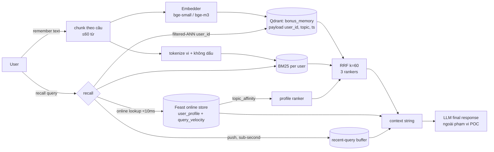

# Bonus — Hybrid Memory cho trợ lý AI tiếng Việt

**Contributors:** Trần Thu Phương 
**Code:** [`agent.py`](agent.py) · [`demo.py`](demo.py) — chạy `python bonus/demo.py` (exit 0)

Trợ lý phải nhớ ba loại thông tin có **nhịp thay đổi khác nhau**, nên mình tách
chúng vào ba nơi lưu khác nhau thay vì nhét chung một chỗ:

| Loại nhớ | Ví dụ | Nhịp đổi | Nơi lưu |
|---|---|---|---|
| Episodic | ghi chú, tài liệu đã đọc | mỗi phút | Qdrant (vector) + BM25 theo user |
| Stable profile | `topic_affinity`, `reading_speed_wpm`, `preferred_language` | tuần | Feast `user_profile_features` (TTL 30 ngày) |
| Recent activity | `queries_last_hour`, query trong phiên | giây | Feast `query_velocity_features` (TTL 1 giờ) + push buffer |

## 1. Sơ đồ kiến trúc

Luồng đọc: `recall()` hỏi **feature store "user này là ai"** và **vector store
"cái gì liên quan"** — đúng mô hình `build_context()` ở NB6 — rồi ghép thành một
chuỗi context để đưa cho LLM.

## 2. Ba quyết định kiến trúc

### Quyết định 1 — Chunking: gói theo câu, tối đa 60 từ (không phải per-message, không phải per-conversation)

- **Per-conversation** (1 vector/cuộc hội thoại): rẻ nhất về storage, nhưng
  embedding của đoạn dài là *trung bình* của nhiều ý → rơi vào "khoảng giữa các
  cụm", đúng lỗi single-shot ở NB6 (balance thấp). Retrieval quality kém.
- **Per-message**: chính xác, nhưng tin nhắn kiểu "ok", "ừ đúng rồi" tạo ra vector
  rác, số point tăng ~10×, và một ý thường trải trên 2–3 tin nhắn.
- **Chọn: gói câu tham lam, không cắt giữa câu, trần 60 từ** (~80–100 token
  tiếng Việt). Đủ nhỏ để mỗi chunk mang 1–2 ý, đủ lớn để không vỡ ngữ cảnh. Khi
  top-3 chunk được nhét vào prompt, tổng ~300 token — rẻ cho context window.
- **Tradeoff chấp nhận:** semantic-break chunking (cắt khi cosine giữa câu liên
  tiếp tụt) cho chất lượng tốt hơn nhưng phải embed từng câu → chi phí ghi tăng
  gấp nhiều lần. Với POC, gói theo câu là điểm cân bằng.

### Quyết định 2 — Feature schema: tabular features, không dùng embedding features

| Feature view | Entity | Features | TTL | Source |
|---|---|---|---|---|
| `user_profile_features` | `user_id` | `topic_affinity`, `reading_speed_wpm`, `preferred_language` | 30 ngày | batch hằng ngày từ warehouse |
| `query_velocity_features` | `user_id` | `queries_last_hour`, `distinct_topics_24h` | 1 giờ | streaming / push |

- **X vs Y:** *embedding feature* (vector "sở thích ẩn" học từ lịch sử) vs
  *tabular feature* (`topic_affinity` dạng enum).
- **Chọn tabular** vì ba lý do: (1) **giải thích được** — context gửi LLM ghi
  rõ "user thích `cloud`", user có thể xem và sửa (quyền được biết theo Nghị định
  13/2023 về bảo vệ dữ liệu cá nhân); (2) `topic_affinity` dùng thẳng làm
  **ranker thứ 3 trong RRF** (boost memory cùng topic) — cùng enum topic với
  `SEARCH_TOOL` ở NB6, nên không thể khớp 0 kết quả. Ranker này chỉ có **trọng
  số 0,3**: lần chạy đầu để trọng số 1,0 thì ở query paraphrase "tự động mở rộng
  hạ tầng", ghi chú về Horizontal Pod Autoscaler (đáp án đúng) bị một ghi chú
  `cloud` không liên quan vượt mặt — profile chỉ biết "user thích cloud", không
  biết memory nào trả lời câu hỏi, nên nó chỉ được làm tie-breaker; (3) đổi embedding model thì
  embedding feature phải tính lại toàn bộ, tabular thì không.
- **Tradeoff chấp nhận:** mất các sở thích tinh tế (ví dụ "thích bài ngắn có code
  mẫu"). Đó là việc của bản sau, khi có đủ lịch sử để học.
- **PIT join:** khi train model gợi ý từ log, phải dùng `get_historical_features()`
  (NB4/NB8) — dùng `topic_affinity` *mới nhất* để gán nhãn cho click cũ là leak.

### Quyết định 3 — Freshness: mỗi tín hiệu một nhịp, không một nhịp cho tất cả

| Use case | Freshness chọn | Cơ chế | Vì sao không nhanh/chậm hơn |
|---|---|---|---|
| "Tôi vừa hỏi gì?" (query 3 trong demo) | **sub-second** | push buffer trong `recall()`, tương đương Feast `PushSource` | User sẽ thấy ngay nếu trợ lý "quên" câu vừa hỏi; batch 5 phút là quá chậm |
| Tài liệu vừa đọc → xuất hiện trong recall | **~vài giây** | `remember()` upsert thẳng vào Qdrant, BM25 rebuild lười ở lần đọc kế | Upsert Qdrant là đồng bộ, không cần pipeline; không có lý do để chờ |
| `topic_affinity` thay đổi | **daily batch** (`materialize-incremental`) | job đêm | Sở thích đổi theo tuần; streaming sẽ tốn chi phí và làm profile "giật" theo 1–2 query lẻ |

Hệ quả thấy được trong demo: `queries_last_hour` từ Feast (batch) **chậm hơn**
push buffer — hai con số được in cạnh nhau một cách có chủ ý, để lộ ra độ trễ
giữa hai đường.

## 3. Lựa chọn đã loại bỏ

1. **Tôi xem xét lưu episodic memory trong Feast** (embedding feature view với
   `vector_index=True`) **nhưng tách sang Qdrant** vì nhịp re-index khác hẳn:
   memory mới mỗi phút, profile mỗi ngày. Feast `materialize` là batch theo
   timestamp, không hợp với ghi liên tục; và Feast không có BM25 nên mất hybrid.
2. **Tôi xem xét một collection Qdrant cho mỗi user** (cách ly cứng) **nhưng chọn
   một collection + payload filter `user_id`** vì 10k user → 10k collection là
   gánh nặng vận hành. Filter được đặt **bên trong** truy vấn (filtered-ANN, NB5),
   không bao giờ post-filter — NB5 đã cho thấy post-filter sập recall ở filter
   chặt, và filter theo một user trong 10k user là filter cực chặt (0,01%).
   `demo.py` assert rằng memory của `u_002` không bao giờ lọt vào context của
   `u_001`. Đây là isolation **mềm** (OWASP LLM08, NB7) — xem phần hạn chế.

## 4. Lưu ý riêng cho người dùng Việt Nam

- **Gõ không dấu:** rất nhiều người gõ "bao mat", "tu dong mo rong". `tokenize()`
  index mỗi từ **hai lần** — có dấu và bỏ dấu (xử lý riêng `đ → d` vì `đ` không
  phải dấu kết hợp trong Unicode). BM25 khớp được cả hai cách viết mà không cần
  model.
- **Hư từ tiếng Việt:** "**Cho** tôi summary cloud security" ban đầu khớp BM25
  với ghi chú "... spot instance **cho** batch job, savings plan **cho** workload"
  và đẩy nó lên #1. Tập memory của một user rất nhỏ nên IDF không đủ dập các từ
  như "cho", "tôi", "gì", "về". `VI_STOPWORDS` (22 từ) bỏ chúng trước khi index —
  sau đó ghi chú cloud security lên #1.
- **Code-switching vi/en:** "Cho tôi summary cloud security" trộn hai ngôn ngữ.
  BM25 giữ nguyên từ tiếng Anh nên khớp chính xác "cloud", "security"; vector
  bắt phần ý nghĩa. Đây là lý do hybrid quan trọng hơn với user VN so với user
  thuần tiếng Anh.
- **Tokenizer:** chọn whitespace split, **không** dùng `pyvi`/`underthesea`.
  Word segmentation ("mở_rộng") cải thiện BM25 thêm vài điểm nhưng thêm
  dependency nặng, chậm trên đường ghi, và sai với thuật ngữ tiếng Anh xen giữa.
  Với hybrid, phần thiếu của BM25 đã được vector bù.
- **Embedding model:** lab dùng `bge-small-en` (yếu với paraphrase tiếng Việt —
  bài học NB2). Production nên đặt `EMBEDDING_BACKEND=bge-m3`; `agent.py` đọc
  biến này qua `app.embeddings.Embedder`, đổi model = đổi số chiều = phải index
  lại toàn bộ memory.
- **Riêng tư (Nghị định 13/2023):** memory là dữ liệu cá nhân, có thể nhạy cảm
  (sức khoẻ, tài chính). Cần quyền xoá theo yêu cầu → `point_id` UUID cho từng
  chunk để xoá chính xác được.

## 5. What this POC doesn't handle yet

- **Cách ly cứng:** payload filter là isolation mềm; quên filter ở một code path
  là rò toàn bộ. Production cần enforce filter ở tầng gateway hoặc dùng
  multitenancy/shard-key của Qdrant, cộng mã hoá per-user.
- **CRUD đầy đủ:** chưa có `forget()`/sửa memory, chưa có TTL hay decay (memory
  không truy cập 30 ngày → archive).
- **Persistence:** Qdrant `:memory:` và BM25 trong RAM — restart là mất hết.
  BM25 rebuild toàn bộ khi có ghi, O(n) mỗi user; ổn cho vài nghìn chunk.
- **Đồng bộ đa thiết bị, consolidation** (gộp memory tương tự thành summary hằng
  tuần), và **không gọi LLM thật** — `recall()` dừng ở context string.
- Push buffer nằm trong process; production phải đẩy qua Feast `PushSource` →
  online store để mọi replica đều thấy.

## Vibe-coding log

- **Prompt hiệu quả nhất:** đưa spec cụ thể kèm ràng buộc — "RRF 3 rankers, rank
  1-based, k=60, filter user_id phải nằm trong `query_filter` chứ không lọc sau".
  Diff ra đúng ngay, chỉ cần review.
- **Chỗ phải tự kiểm tra:** bỏ dấu tiếng Việt bằng `unicodedata` NFD là lời giải
  "trông đúng" mà AI hay đưa ra, nhưng NFD **không** tách được `đ` (nó là chữ
  riêng, không phải `d` + dấu) — "đám mây" sẽ thành "đam may". `strip_diacritics()`
  xử lý `đ/Đ` riêng; thử với một từ có `đ` trước khi tin. Đúng như VIBE-CODING.md
  nói: lỗi im lặng là vùng phải tự nghĩ.
